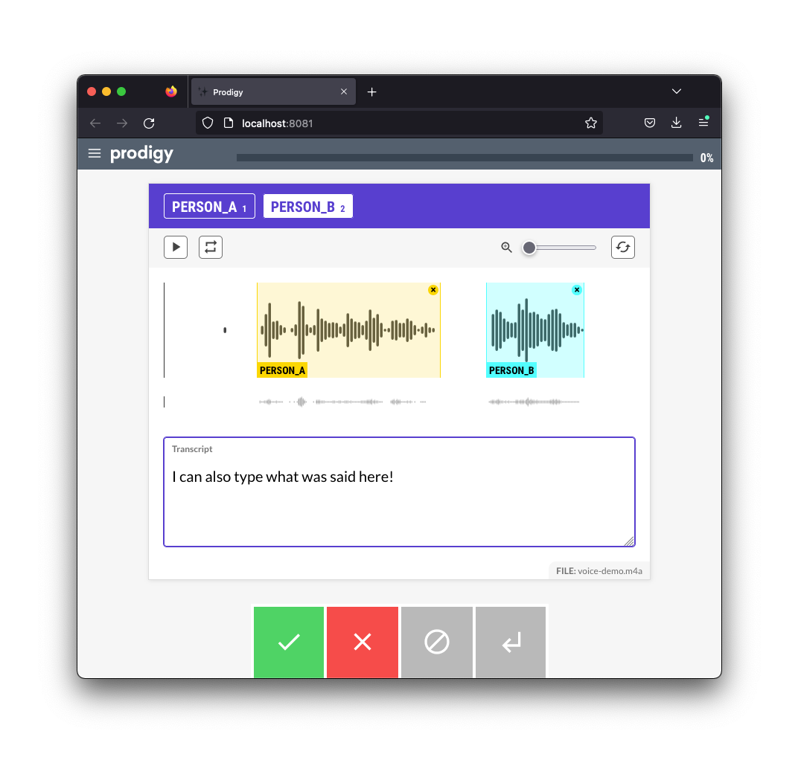

## Audio Transcription and Manual Annotation 

This recipe demonstrates the [blocks feature](https://prodi.gy/docs/custom-interfaces#blocks) to construct an annotation interface that can handle both manual audio annotation as well as transcription.




You can run the recipe via: 

```
python -m prodigy audio.manual-with-transcript <dataset> <audio-folder> --label person_a,person_b -F recipe.py
```