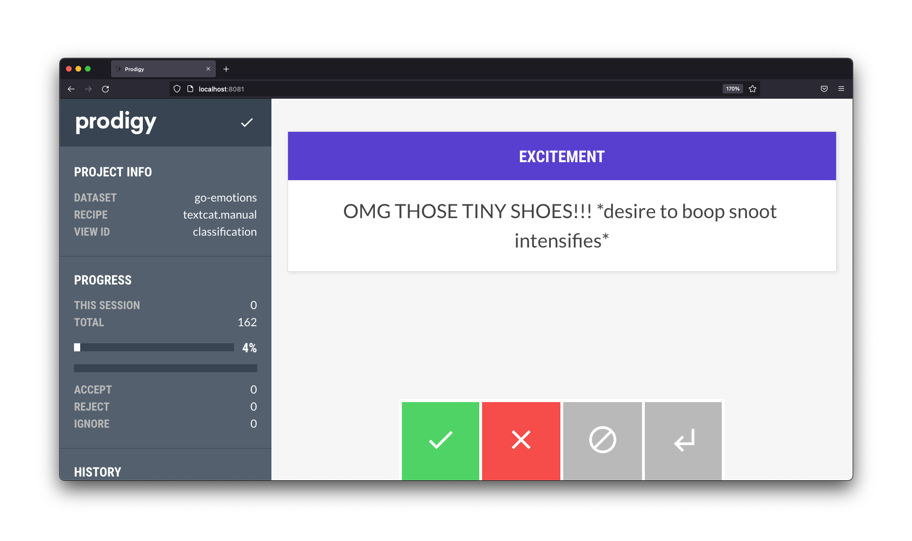

# prodigy-google-emotions-demo

This project contains a few tricks to find bad labels in the [Google Emotions dataset](https://github.com/google-research/google-research/tree/master/goemotions). In particular, we will try to find bad labels for the "excitement" emotion.



If you're curious, this project is the end-result of [this Youtube tutorial](https://youtu.be/khZ5-AN-n2Y). Check it out if you want to learn more about [Prodigy](https://prodi.gy)!

## Fair Warning 

The dataset comes from Reddit, which is known for vulgar language. An effort
has been made to clean the data of the most horrible comments, but one should
assume that there's plenty insensitive comments left in. To learn more
about how the data was cleaned, read the [paper](https://arxiv.org/abs/2005.00547).

## Installation 

The installation process is automated via `make`.

```bash
# Install all dependencies
make install
# Download and prepare the GoEmotions data
make download
```

In order for the install to work, you'll need to
add a `.env` file to the root of the project that
contains your prodigy license key. It should look
something like:

```
PRODIGY_KEY="1234-ABCD-5678-EFGH"
```

## Contents 

The project has a few notable notebooks: 

- The `01-heuristic.ipynb` notebook tries to find bad examples by using common sense. If the word "excitement" appears in the sentence, is it not about excitement? 
- The `02-models.ipynb` notebook tries to detect bad labels by leveraging ML models. If scikit-learn is confident that it is about excitement, but the label says it isn't ... something might be up. 
- The `03-embeddings.ipynb` notebook uses pre-trained embeddings to create many models that might disagree. Disagreement can also be a proxy for bad labels.
- The `04-prodigy-prep.ipynb` prepares the data for Prodigy. It uses [doubtlab](https://github.com/koaning/doubtlab) to sort interesting examples.

## Usage

Assuming you've ran `04-prodigy-prep.ipynb` you should see a 
`doubt.jsonl` file appear, which can be loaded into Prodigy.

```bash
python -m prodigy textcat.manual go-emotions doubt.jsonl --label excitement
```
