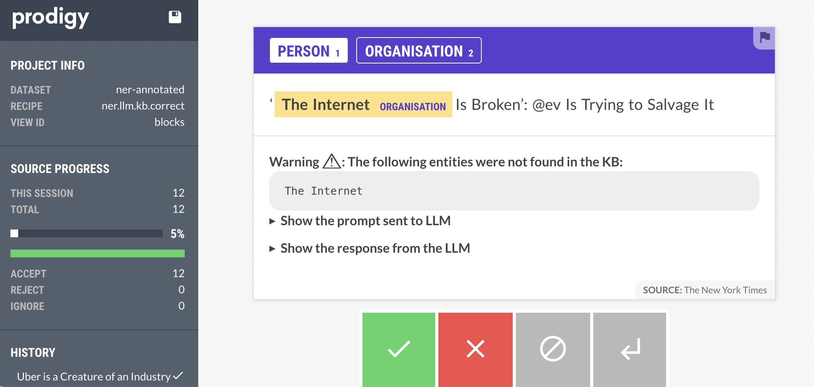

# Bootstrapping NER annotations with a Large Language Model and a Knowledge Base

This folders contains a recipe which uses both a LLM and a KB to pre-annotate text with NER labels.
Whenever LLM annotations are not present in the KB or the labels do not correspond a warning is shown in the UI.
If the LLM annotations are successfully validated by the KB, the annotations can be automatically accepted reducing the number of examples that an annotator must curate.

This recipe is a customised (and simplified) version of Prodigy `ner.llm.correct` recipe.
It uses DBpedia Spotlight entity linker as a KB via [`spacy-dbpedia-spotlight`](https://github.com/MartinoMensio/spacy-dbpedia-spotlight) library. 



## Try it out 

To try this recipe make sure you have at least Prodigy 1.13 installed as well as `dpacy-dbpedia-spotlight` (listed in `requirements.txt`).

Have some input data available, for example `news_headlines.jsonl` (found in the `example-datasets` folder).

Adapt the `spacy-llm` config file: `spacy.cfg` to use the LLM of your choice (make sure the name of the component is `llm`).

To start the server run (assuming the environment variables for the LLM API are in `.env` file):
```
dotenv run -- python -m prodigy ner.llm.kb.correct ner-annotated spacy.cfg news_headlines.jsonl Person,Organisation -F ner_llm_kb_correct.py
```

When setting `-V` flag, the examples that are successfully validated by the KB will be automatically accepted.

You can now curate the examples and flag the ones that require some further postprocessing. For example, you could use the flag feature to mark the examples that should be used for augmenting your custom KB.

DBpedia spotlight is a general domain knowledge base, but you can use your domain specific knowledge base in a similar way to even better constraint the LLM annotations and find new entities to feed back to your KB.

Please note the usability of this workflow depends a lot on how good your entity linker is. 