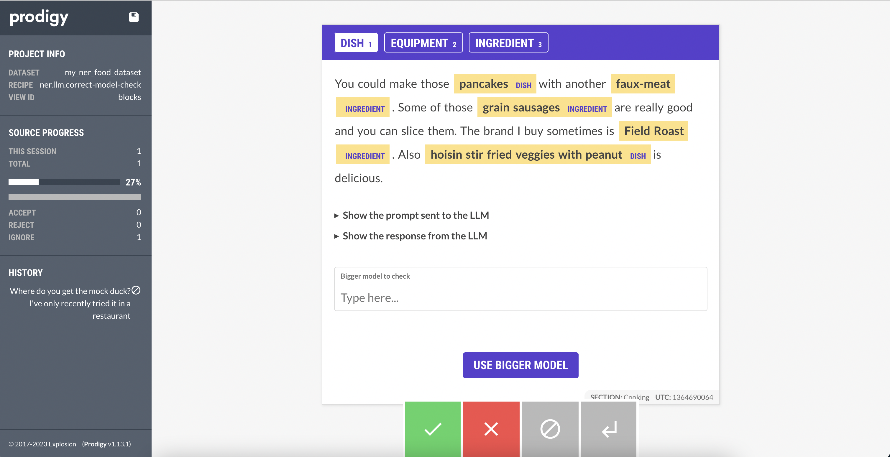

## Double check your smaller LLM annotations against GPT-4

This recipe demonstrates the custom Prodigy Recipe Event Hooks feature which adds support for interactivity to Prodigy.

Event hooks can be returned from a Prodgiy Recipe as an additional component alongside the `dataset`, `view_id`, etc. mapping the event name, to a custom function.

Read more about the [Prodigy Event Hooks Docs](https://prodi.gy/event-hooks).

```python
from prodigy import Controller, recipe


def my_event_hook(ctrl: Controller, *, example: TaskType):
    print("Answered Task:", example)
    # send_webhook_with_prodigy_answer(example)


@recipe("events-recipe")
def events_recipe(dataset: str):

    return {
        "view_id": "text",
        "dataset": dataset,
        "event_hooks": {
            "my_event_hook": my_event_hook
        }
    }

```


This recipe builds on the new LLM NER workflow which utilizes `spacy-llm` to use a Large Language Model to predict NER annotations.

The difference from from the built-in `prodigy ner.llm.correct` recipe is this allows you to use a smaller, cheaper model like `text-davinci-003` or a smaller variant of Llama 2 and then on-demand, check a single example against a larger model like `GPT-3.5` or `GPT-4`.





## Try it out

You can try out this recipe with a spacy-llm NER config that uses a smaller OpenAI model.

First, you'll need an OpenAI API Key available in your environment. Then you can run the following command.


```bash
export OPENAI_API_KEY="sk-..."
python -m prodigy ner.llm.correct-model-check my_ner_food_dataset ./ner_zeroshot.cfg ./food_data_sample.jsonl -F ./ner_llm_model_check.py
```
