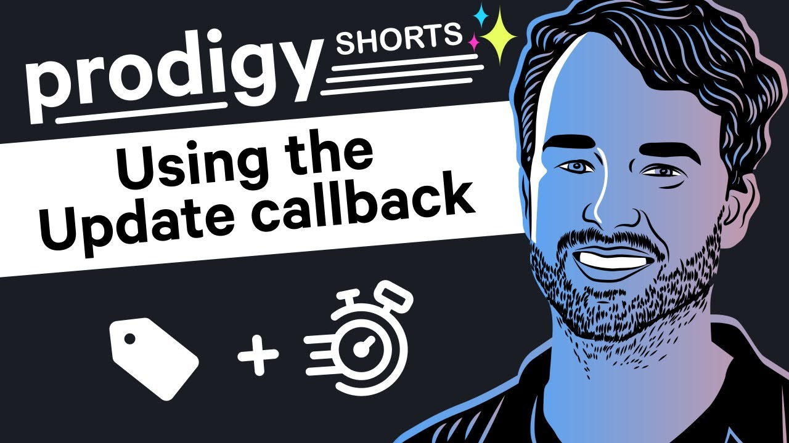

# Showing Annotation Progress

> Note! This examples requires [rich](https://github.com/Textualize/rich) to be installed! 

This project shows a demo of the `update()` callback that can keep track of your annotation speed. 

It was part of [this prodigy short])(https://youtu.be/uBtOebwnTRs).