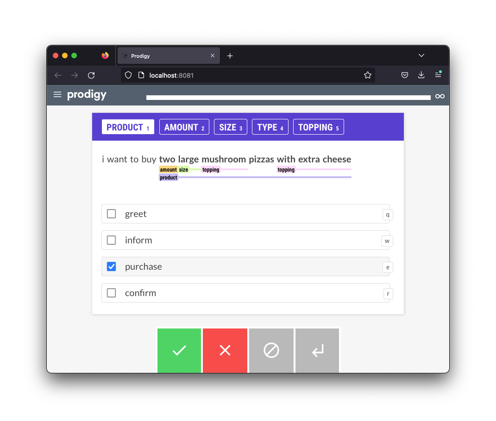

# Annotating Chatbot Logs

This recipe combines spancat annotation with textcat annotation, which is a great combo when annotating chatbot logs. 



You can run the recipe via; 

```
python -m prodigy span-and-textcat bot-demo en examples.jsonl -F recipe.py
```
