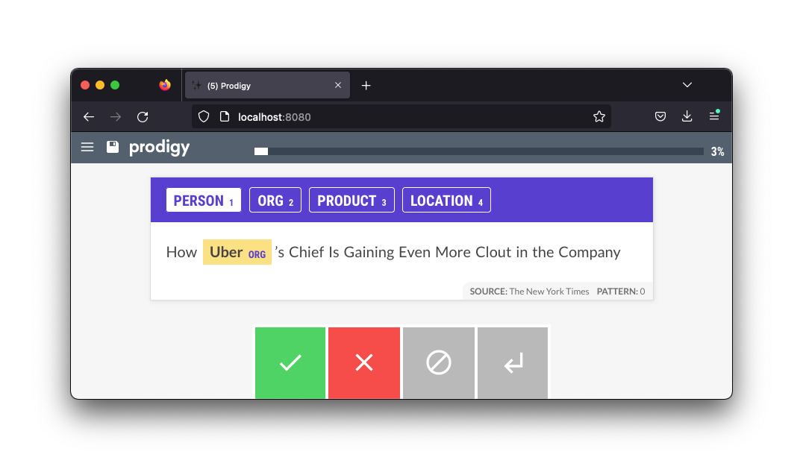

# Terms from NER Annotations

This folder contains a recipe that allows you to turn your pre-existing NER annotations into patterns that you can re-use. Having such patterns is great, because these can help pre-highlight text in Prodigy. 



## Try it out 

To try this recipe, you can start by first annotating some data from `news_headlines.jsonl`, via; 

```
python -m prodigy ner.manual news_demo blank:en news_headlines.jsonl --label PERSON,ORG,PRODUCT,LOCATION
```

Then, after annotating a few examples, you can generate a `patterns.jsonl` file that contains patterns. 

```
python -m prodigy terms.from-ner ner_news_headlines patterns.jsonl -F recipe.py
```

Finally, you can now re-use these patterns in your original `ner.manual` recipe, via: 

```
python -m prodigy ner.manual news_demo blank:en news_headlines.jsonl --label PERSON,ORG,PRODUCT,LOCATION --patterns patterns.jsonl
```